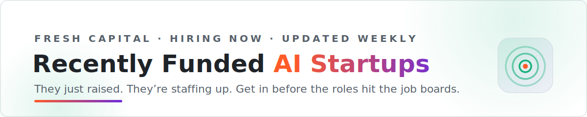

<picture>
  <source media="(prefers-color-scheme: dark)" srcset="assets/banner-dark.svg">
  
</picture>

   

**AI startups that just raised — sorted by sector, newest capital first.**
Fresh funding means fresh headcount. These teams are staffing up *right now*, often before a single role hits the job boards.

*Curated weekly by [Landed](https://landed.jobs).*

[💸 Biggest raises](#biggest-raises) · [🏗️ AI Infrastructure](#ai-infrastructure) · [🤖 Agents & Automation](#agents-automation) · [🛠️ Developer Tools](#developer-tools) · [📊 Data & Analytics](#data-analytics) · [🧬 Healthcare & Bio](#healthcare-bio) · [🦾 Robotics & Hardware](#robotics-hardware) · [💳 Fintech](#fintech) · [🔐 Security](#security) · [⚖️ Legal & Compliance](#legal-compliance) · [📈 Sales & GTM](#sales-gtm) · [🏢 Enterprise SaaS](#enterprise-saas) · [🛍️ Consumer](#consumer) · [🛰️ Defense & Aerospace](#defense-aerospace) · [🌱 Climate & Energy](#climate-energy)

---

> **Why a funding list is a job list** — a round closes, the team's #1 job becomes hiring, and for a few weeks the fastest way in is to reach the founder directly (the people in these posts) before the careers page even updates. This list tracks who just raised, what they do, and who backed them — so you can apply while the door is widest. ⭐ **Star it** — refreshed weekly.

## Jump to

- [💸 Biggest raises this month](#biggest-raises) · **12**
- [🏗️ AI Infrastructure](#ai-infrastructure) · **15**
- [🤖 Agents & Automation](#agents-automation) · **4**
- [🛠️ Developer Tools](#developer-tools) · **3**
- [📊 Data & Analytics](#data-analytics) · **7**
- [🧬 Healthcare & Bio](#healthcare-bio) · **14**
- [🦾 Robotics & Hardware](#robotics-hardware) · **9**
- [💳 Fintech](#fintech) · **12**
- [🔐 Security](#security) · **3**
- [⚖️ Legal & Compliance](#legal-compliance) · **2**
- [📈 Sales & GTM](#sales-gtm) · **2**
- [🏢 Enterprise SaaS](#enterprise-saas) · **6**
- [🛍️ Consumer](#consumer) · **7**
- [🛰️ Defense & Aerospace](#defense-aerospace) · **6**
- [🌱 Climate & Energy](#climate-energy) · **4**

> ➕ **Spotted a raise we're missing?** [Add it →](https://github.com/landedjobs/recently-funded-ai-startups-hiring/issues/new?template=add-startup.yml) · see [CONTRIBUTING](CONTRIBUTING.md)

---

## 💸 Biggest raises this month · 12

_The largest rounds in the window — the teams with the most new runway to spend on people._

<table>
<tr><th align="center">Company</th><th align="center">Raised</th><th align="left">What they do &amp; who backed them</th><th align="center">Go</th></tr>
<tr><td align="center" width="130"> <b><a href="https://x.com/deepseek_ai">DeepSeek</a></b> 📍 China</td><td align="center" width="90"><b>$7.4B</b> unknown 🗓️ 1w ago</td><td>Open-source AGI research lab based in China.</td><td align="center" width="140"> </td></tr>
<tr><td align="center" width="130"> <b><a href="https://x.com/baseten">Baseten</a></b> 📍 San Francisco</td><td align="center" width="90"><b>$1.5B</b> Series F 🗓️ 6d ago</td><td>AI inference company powering advanced AI applications, post-training and serving open-weight models at production scale across 87 clusters globally spanning 18 clouds. Processes over 1B inference calls daily for customers including Cursor, Notion, Lovable, Harvey, HubSpot, and Abridge. 🧑‍💼 Tuhin Srivastava, Amir Haghighat, Philip Kiely, Pankaj Gupta 💰 <b>Altimeter</b>, <b>Conviction</b>, <b>Spark Capital</b> · Sands Capital, Wellington Management, IVP, Greylock</td><td align="center" width="140"> </td></tr>
<tr><td align="center" width="130"> <b><a href="https://x.com/appsflyer">AppsFlyer</a></b></td><td align="center" width="90"><b>$1B</b> Series E 🗓️ 6d ago</td><td>Mobile marketing analytics platform.</td><td align="center" width="140"> </td></tr>
<tr><td align="center" width="130"> <b><a href="https://x.com/CtrlSdc">CtrlS</a></b> 📍 India</td><td align="center" width="90"><b>$423M</b> unknown 🗓️ 1w ago</td><td>AI data centers in India.</td><td align="center" width="140"> </td></tr>
<tr><td align="center" width="130"> <b><a href="https://x.com/cusp_ai">Cusp AI</a></b> 📍 United Kingdom</td><td align="center" width="90"><b>$400M</b> unknown 🗓️ 1w ago</td><td>AI-driven materials discovery, based in the UK.</td><td align="center" width="140"> </td></tr>
<tr><td align="center" width="130"> <b><a href="https://x.com/fundable_ai/status/2070573414939525444">Nearfield Instruments</a></b></td><td align="center" width="90"><b>$380M</b> Series D 🗓️ 6d ago</td><td>Semiconductor 3D metrology.</td><td align="center" width="140"> </td></tr>
<tr><td align="center" width="130"> <b><a href="https://x.com/ollinbio">Ollin Bio</a></b></td><td align="center" width="90"><b>$330M</b> Series B 🗓️ 6d ago</td><td>Developing a retinal disease bispecific antibody.</td><td align="center" width="140"> </td></tr>
<tr><td align="center" width="130"> <b><a href="https://x.com/airwallex">Airwallex</a></b></td><td align="center" width="90"><b>$320M</b> Series H 🗓️ 6d ago</td><td>AI financial platform.</td><td align="center" width="140"> </td></tr>
<tr><td align="center" width="130"> <b><a href="https://x.com/odysseyml">Odyssey</a></b> 📍 Palo Alto</td><td align="center" width="90"><b>$310M</b> Series B 🗓️ 1w ago</td><td>World model AI startup building systems that simulate the physical world with accurate physics and causality, targeting robotics, gaming, autonomous vehicles, and defense. AWS is named preferred cloud provider with Trainium chip access. 🧑‍💼 Oliver Cameron, Jeffrey Hawke 💰 <b>Natural Capital</b>, <b>Amazon</b> · Jeff Dean, Garry Tan, Kyle Vogt</td><td align="center" width="140"> </td></tr>
<tr><td align="center" width="130"> <b><a href="https://x.com/fundable_ai/status/2068075550145761575">Evoken</a></b> 📍 China</td><td align="center" width="90"><b>$300M</b> Series B 🗓️ 1w ago</td><td>AI creative content platform, based in China.</td><td align="center" width="140"> </td></tr>
<tr><td align="center" width="130"> <b><a href="https://x.com/SiliconFlowAI">SiliconFlow</a></b> 📍 Singapore</td><td align="center" width="90"><b>$294M</b> Series B 🗓️ 1w ago</td><td>Singapore-based AI infrastructure platform offering high-volume token-based model access across 160+ open-source models, processing roughly 1 trillion tokens daily with 10M+ users and 10,000+ enterprise clients. 🧑‍💼 Jinhui Yuan 💰 Trip.com, SenseTime, Nio Capital, GGV Capital</td><td align="center" width="140"> </td></tr>
<tr><td align="center" width="130"> <b><a href="https://x.com/fundable_ai/status/2068075550145761575">Principal Mineral</a></b> 📍 United States</td><td align="center" width="90"><b>$280M</b> unknown 🗓️ 1w ago</td><td>Critical minerals midstream, based in the US.</td><td align="center" width="140"> </td></tr>
</table>

[⬆ back to top](#top)

---

## 🏗️ AI Infrastructure · 15

<table>
<tr><th align="center">Company</th><th align="center">Raised</th><th align="left">What they do &amp; who backed them</th><th align="center">Go</th></tr>
<tr><td align="center" width="130"> <b><a href="https://x.com/deepseek_ai">DeepSeek</a></b> 📍 China</td><td align="center" width="90"><b>$7.4B</b> unknown 🗓️ 1w ago</td><td>Open-source AGI research lab based in China.</td><td align="center" width="140"> </td></tr>
<tr><td align="center" width="130"> <b><a href="https://x.com/baseten">Baseten</a></b> 📍 San Francisco</td><td align="center" width="90"><b>$1.5B</b> Series F 🗓️ 6d ago</td><td>AI inference company powering advanced AI applications, post-training and serving open-weight models at production scale across 87 clusters globally spanning 18 clouds. Processes over 1B inference calls daily for customers including Cursor, Notion, Lovable, Harvey, HubSpot, and Abridge. 🧑‍💼 Tuhin Srivastava, Amir Haghighat, Philip Kiely, Pankaj Gupta 💰 <b>Altimeter</b>, <b>Conviction</b>, <b>Spark Capital</b> · Sands Capital, Wellington Management, IVP, Greylock</td><td align="center" width="140"> </td></tr>
<tr><td align="center" width="130"> <b><a href="https://x.com/CtrlSdc">CtrlS</a></b> 📍 India</td><td align="center" width="90"><b>$423M</b> unknown 🗓️ 1w ago</td><td>AI data centers in India.</td><td align="center" width="140"> </td></tr>
<tr><td align="center" width="130"> <b><a href="https://x.com/cusp_ai">Cusp AI</a></b> 📍 United Kingdom</td><td align="center" width="90"><b>$400M</b> unknown 🗓️ 1w ago</td><td>AI-driven materials discovery, based in the UK.</td><td align="center" width="140"> </td></tr>
<tr><td align="center" width="130"> <b><a href="https://x.com/odysseyml">Odyssey</a></b> 📍 Palo Alto</td><td align="center" width="90"><b>$310M</b> Series B 🗓️ 1w ago</td><td>World model AI startup building systems that simulate the physical world with accurate physics and causality, targeting robotics, gaming, autonomous vehicles, and defense. AWS is named preferred cloud provider with Trainium chip access. 🧑‍💼 Oliver Cameron, Jeffrey Hawke 💰 <b>Natural Capital</b>, <b>Amazon</b> · Jeff Dean, Garry Tan, Kyle Vogt</td><td align="center" width="140"> </td></tr>
<tr><td align="center" width="130"> <b><a href="https://x.com/SiliconFlowAI">SiliconFlow</a></b> 📍 Singapore</td><td align="center" width="90"><b>$294M</b> Series B 🗓️ 1w ago</td><td>Singapore-based AI infrastructure platform offering high-volume token-based model access across 160+ open-source models, processing roughly 1 trillion tokens daily with 10M+ users and 10,000+ enterprise clients. 🧑‍💼 Jinhui Yuan 💰 Trip.com, SenseTime, Nio Capital, GGV Capital</td><td align="center" width="140"> </td></tr>
<tr><td align="center" width="130"> <b><a href="https://x.com/fundable_ai/status/2068075569615417427">Galaxy Data Center</a></b> 📍 Singapore</td><td align="center" width="90"><b>$250M</b> unknown 🗓️ 1w ago</td><td>Singapore-based next-generation AI data center platform building GW-scale hyperscale AI data centers for AI and cloud computing across Southeast Asia, serving surging regional demand for high-density GPU infrastructure. 🧑‍💼 Arthur Yang</td><td align="center" width="140"> </td></tr>
<tr><td align="center" width="130"> <b><a href="https://x.com/MirendilAI">Mirendil</a></b></td><td align="center" width="90"><b>$200M</b> seed 🗓️ 2d ago</td><td>Self-accelerating AI that automates scientific R&D.</td><td align="center" width="140"> </td></tr>
<tr><td align="center" width="130"> <b><a href="https://x.com/sailresearchco">Sail</a></b></td><td align="center" width="90"><b>$80M</b> seed 🗓️ 2d ago</td><td>Inference infrastructure for AI agents. Emerged from stealth.</td><td align="center" width="140"> </td></tr>
<tr><td align="center" width="130"> <b><a href="https://x.com/OrnnExchange">Ornn Exchange</a></b></td><td align="center" width="90"><b>$33M</b> seed 🗓️ 2d ago</td><td>Market infrastructure for GPU compute.</td><td align="center" width="140"> </td></tr>
<tr><td align="center" width="130"> <b><a href="https://x.com/optalysys">optalysys</a></b></td><td align="center" width="90"><b>$29M</b> Series A 🗓️ 2w ago</td><td>Optical computing company, cited as a portfolio company of Duncan Johnson at Northern Gritstone.</td><td align="center" width="140"> </td></tr>
<tr><td align="center" width="130"> <b><a href="https://x.com/taste_ai_">taste</a></b></td><td align="center" width="90"><b>$18.5M</b> seed 🗓️ 1w ago</td><td>AI taste and judgment layer.</td><td align="center" width="140"> </td></tr>
<tr><td align="center" width="130"> <b><a href="https://x.com/seltz_ai">seltz</a></b></td><td align="center" width="90"><b>$12.5M</b> seed 🗓️ 2d ago</td><td>Web knowledge layer for AI agents.</td><td align="center" width="140"> </td></tr>
<tr><td align="center" width="130"> <b><a href="https://x.com/superplanehq">superplane</a></b></td><td align="center" width="90"><b>$2.6M</b> pre-seed 🗓️ 3d ago</td><td>AI-first infrastructure control plane.</td><td align="center" width="140"> </td></tr>
<tr><td align="center" width="130"> <b><a href="https://x.com/fundable_ai/status/2071712564749471771">Wakeline</a></b></td><td align="center" width="90"><b>$2.38M</b> pre-seed 🗓️ 3d ago</td><td>Continuously adaptive AI systems.</td><td align="center" width="140"> </td></tr>
</table>

[⬆ back to top](#top)

---

## 🤖 Agents & Automation · 4

<table>
<tr><th align="center">Company</th><th align="center">Raised</th><th align="left">What they do &amp; who backed them</th><th align="center">Go</th></tr>
<tr><td align="center" width="130"> <b><a href="https://x.com/poetichq">Poetic</a></b></td><td align="center" width="90"><b>$50M</b> Series A 🗓️ 2w ago</td><td>Enterprise workflow automation.</td><td align="center" width="140"> </td></tr>
<tr><td align="center" width="130"> <b><a href="https://x.com/SWARMeng">SWARM Engineering</a></b></td><td align="center" width="90"><b>$10M</b> Series A 🗓️ 2w ago</td><td>Decision intelligence platform for agrifood and manufacturing that uses domain-trained AI agents and optimization algorithms to drive operational decisions across supply chain, workforce, and logistics. Trusted by Cargill, Ardent Mills, and Wilbur-Ellis. Oversubscribed round. 🧑‍💼 Shail Khiyara 💰 <b>S2G Investments</b>, <b>AgRogue Growth Partners</b> · Radicle Growth, Grit Road Partners</td><td align="center" width="140"> </td></tr>
<tr><td align="center" width="130"> <b><a href="https://x.com/BuildWithFloqer">Floqer</a></b></td><td align="center" width="90"><b>$2M</b> pre-seed 🗓️ 3d ago</td><td>Autonomous customer knowledge base.</td><td align="center" width="140"> </td></tr>
<tr><td align="center" width="130"> <b><a href="https://x.com/Superpal_ai">Superpal</a></b> 📍 Vilnius</td><td align="center" width="90"><b>$570K</b> pre-seed 🗓️ 3d ago</td><td>Vilnius startup building a fully autonomous AI coworker that operates inside Slack and integrates with 1,000+ business tools, executing tasks across sales, marketing, HR, and operations workflows directly from chat. 🧑‍💼 Gabrielius Mažeikis 💰 <b>FIRSTPICK</b> · Outlast Fund</td><td align="center" width="140"> </td></tr>
</table>

[⬆ back to top](#top)

---

## 🛠️ Developer Tools · 3

<table>
<tr><th align="center">Company</th><th align="center">Raised</th><th align="left">What they do &amp; who backed them</th><th align="center">Go</th></tr>
<tr><td align="center" width="130"> <b><a href="https://x.com/fundable_ai/status/2070127202419515502">Tsuga</a></b> 📍 Paris</td><td align="center" width="90"><b>$35M</b> Series A 🗓️ 1w ago</td><td>Paris startup deploying observability software inside the customer's own cloud, eliminating variable data-transfer taxes charged by Datadog and Dynatrace. Telemetry, prompt streams, and agent traces stay under customer control for security and data sovereignty. Millions in ARR with six-figure ACVs. 🧑‍💼 Gilles Haplo, Sébastien Deprez 💰 <b>Singular</b> · General Catalyst, DST Global, QuantumLight, Picus</td><td align="center" width="140"> </td></tr>
<tr><td align="center" width="130"> <b><a href="https://x.com/soffi_dev">soffi</a></b></td><td align="center" width="90"><b>$4.6M</b> pre-seed 🗓️ 2w ago</td><td>Collaborative dev environment.</td><td align="center" width="140"> </td></tr>
<tr><td align="center" width="130"> <b><a href="https://x.com/fundable_ai/status/2071712590569628106">Sherlocks AI</a></b></td><td align="center" width="90"><b>$900K</b> pre-seed 🗓️ 3d ago</td><td>AI-native incident resolution platform that autonomously investigates production issues, ingesting logs, traces, and metrics to identify root causes and surface fixes without requiring engineers to manually triage alerts. 🧑‍💼 Gaurav Toshniwal, Akshat Jain 💰 <b>Sense AI Ventures</b> · Uppekkha</td><td align="center" width="140"> </td></tr>
</table>

[⬆ back to top](#top)

---

## 📊 Data & Analytics · 7

<table>
<tr><th align="center">Company</th><th align="center">Raised</th><th align="left">What they do &amp; who backed them</th><th align="center">Go</th></tr>
<tr><td align="center" width="130"> <b><a href="https://x.com/appsflyer">AppsFlyer</a></b></td><td align="center" width="90"><b>$1B</b> Series E 🗓️ 6d ago</td><td>Mobile marketing analytics platform.</td><td align="center" width="140"> </td></tr>
<tr><td align="center" width="130"> <b><a href="https://x.com/peregrine_ps">Peregrine</a></b></td><td align="center" width="90"><b>$250M</b> Series D 🗓️ 6d ago</td><td>AI public safety data platform.</td><td align="center" width="140"> </td></tr>
<tr><td align="center" width="130"> <b><a href="https://x.com/Balconytech">Balcony</a></b></td><td align="center" width="90"><b>$12.7M</b> seed 🗓️ 1w ago</td><td>Property data infrastructure.</td><td align="center" width="140"> </td></tr>
<tr><td align="center" width="130"> <b><a href="https://x.com/noxmetals">nox</a></b></td><td align="center" width="90"><b>$11.5M</b> seed 🗓️ 1w ago</td><td>AI metals supplier.</td><td align="center" width="140"> </td></tr>
<tr><td align="center" width="130"> <b><a href="https://x.com/fundable_ai/status/2070189292068974610">Optiml</a></b></td><td align="center" width="90"><b>$8.7M</b> seed 🗓️ 1w ago</td><td>Real estate decision intelligence.</td><td align="center" width="140"> </td></tr>
<tr><td align="center" width="130"> <b><a href="https://x.com/fundable_ai/status/2066627224808337801">BeatpulseLabs</a></b></td><td align="center" width="90"><b>$1.8M</b> pre-seed 🗓️ 2w ago</td><td>AI data infrastructure company transforming expert human judgment and multimedia content into high-fidelity training datasets for multimodal AI models, using in-house domain specialists instead of generic annotators. 10x revenue growth in H1 2026. 🧑‍💼 Jason Rieff, Nikolay Vitanov 💰 <b>Araya Ventures</b>, <b>Lighthouse Ventures</b> · Alumni Ventures, Avalancha Ventures</td><td align="center" width="140"> </td></tr>
<tr><td align="center" width="130"> <b><a href="https://x.com/fundable_ai/status/2072377588950135139">Bianca AI</a></b> 📍 Buenos Aires</td><td align="center" width="90"><b>$500K</b> pre-seed 🗓️ 1d ago</td><td>A Buenos Aires (Y Combinator) startup building an AI company brain for consumer-packaged-goods firms, unifying ERP, distributor, and retail data to surface risks and opportunities before they show up in traditional reports. Customers reportedly see around 14% sales uplift. Round was oversubscribed. 🧑‍💼 Nicolás Casaux, Nicolás de León, Ramiro Godfrid 💰 <b>Magma Partners</b>, <b>MatterScale</b> · Kellogg angels</td><td align="center" width="140"> </td></tr>
</table>

[⬆ back to top](#top)

---

## 🧬 Healthcare & Bio · 14

<table>
<tr><th align="center">Company</th><th align="center">Raised</th><th align="left">What they do &amp; who backed them</th><th align="center">Go</th></tr>
<tr><td align="center" width="130"> <b><a href="https://x.com/ollinbio">Ollin Bio</a></b></td><td align="center" width="90"><b>$330M</b> Series B 🗓️ 6d ago</td><td>Developing a retinal disease bispecific antibody.</td><td align="center" width="140"> </td></tr>
<tr><td align="center" width="130"> <b><a href="https://x.com/fundable_ai/status/2070573414939525444">Osanni Bio</a></b></td><td align="center" width="90"><b>$190M</b> Series B 🗓️ 6d ago</td><td>Drug discovery platform.</td><td align="center" width="140"> </td></tr>
<tr><td align="center" width="130"> <b><a href="https://x.com/fundable_ai/status/2070573444492579089">Bionyra Pharma</a></b></td><td align="center" width="90"><b>$165M</b> Series A 🗓️ 6d ago</td><td>Clinical-stage biotech developing next-generation mono and multispecific antibodies for immune-mediated inflammatory diseases, targeting IBD and atopic dermatitis patients inadequately controlled on existing therapies. Two assets already in Phase 1 trials and a third at IND stage. 🧑‍💼 Frederic Marrache 💰 <b>Jeito Capital</b>, <b>Sofinnova Partners</b> · Arkin Bio, Sanofi Ventures, Sixty Degree Capital, Vives Partners</td><td align="center" width="140"> </td></tr>
<tr><td align="center" width="130"> <b><a href="https://x.com/AssortHealth">AssortHealth</a></b> 📍 San Francisco</td><td align="center" width="90"><b>$120M</b> Series C 🗓️ 6d ago</td><td>San Francisco AI agents platform automating the patient journey, handling scheduling, intake, referrals, document processing, medication refills, and payments. Built on 190M+ patient interactions, 62,000 care protocols, and 1.6M decision pathways. Revenue grew 20x in 15 months; valued at $1.2B. 🧑‍💼 Jon Wang, Jeff Liu 💰 <b>Menlo Ventures</b> · Lightspeed, Felicis, First Round, Chemistry</td><td align="center" width="140"> </td></tr>
<tr><td align="center" width="130"> <b><a href="https://x.com/fundable_ai/status/2070127178201657664">Memento Medicines</a></b> 📍 Boston</td><td align="center" width="90"><b>$93M</b> Series A 🗓️ 1w ago</td><td>Boston biotech developing MMT-205, a bispecific antibody that simultaneously activates Tie2 and inhibits VEGF, designed to improve upon anti-VEGF monotherapies for neovascular AMD and diabetic macular edema. First-in-human trials planned for 2027. 🧑‍💼 Naveen Daryani 💰 <b>Forbion</b>, <b>RA Capital Management</b>, <b>Avego BioScience Capital</b> · Sanofi Ventures, Samsara BioCapital</td><td align="center" width="140"> </td></tr>
<tr><td align="center" width="130"> <b><a href="https://x.com/RadicalNumerics">Radical Numerics</a></b></td><td align="center" width="90"><b>$50M</b> seed 🗓️ 1w ago</td><td>Biological AI lab.</td><td align="center" width="140"> </td></tr>
<tr><td align="center" width="130"> <b><a href="https://x.com/vedana_tx">vedana</a></b></td><td align="center" width="90"><b>$46M</b> Series A 🗓️ 1w ago</td><td>Next-generation migraine prevention.</td><td align="center" width="140"> </td></tr>
<tr><td align="center" width="130"> <b><a href="https://x.com/fundable_ai/status/2070127205296808036">Astral Systems</a></b> 📍 Bristol</td><td align="center" width="90"><b>$30M</b> Series A 🗓️ 1w ago</td><td>Bristol deeptech producing medical radioisotopes critical for cancer care using compact Multi-State Fusion (MSF) reactors, bypassing an aging global supply chain of fission reactors. Three commercial facilities already operating with over 3M pounds in revenue; first therapeutic isotopes targeting market by early 2027. 🧑‍💼 Talmon Firestone, Tom Wallace-Smith 💰 <b>Mercia Ventures</b> · Tees River, Daphni, Blast Club, Speedinvest</td><td align="center" width="140"> </td></tr>
<tr><td align="center" width="130"> <b><a href="https://x.com/kliniccare">Klinic</a></b></td><td align="center" width="90"><b>$24M</b> Series A 🗓️ 2w ago</td><td>Specialty provider enablement.</td><td align="center" width="140"> </td></tr>
<tr><td align="center" width="130"> <b><a href="https://x.com/fundable_ai/status/2067326258376011909">Neion Bio</a></b></td><td align="center" width="90"><b>$23M</b> Series A 🗓️ 2w ago</td><td>Egg-based biologics manufacturing.</td><td align="center" width="140"> </td></tr>
<tr><td align="center" width="130"> <b><a href="https://x.com/fesariustherapy">Fesarius Therapeutics</a></b></td><td align="center" width="90"><b>$20M</b> Series A 🗓️ 2w ago</td><td>Dermal regeneration medtech.</td><td align="center" width="140"> </td></tr>
<tr><td align="center" width="130"> <b><a href="https://x.com/fundable_ai/status/2071712564749471771">Kyrok</a></b></td><td align="center" width="90"><b>$3.54M</b> pre-seed 🗓️ 3d ago</td><td>AI operating system for pharma supply chains.</td><td align="center" width="140"> </td></tr>
<tr><td align="center" width="130"> <b><a href="https://x.com/VitalisOrtho">Vitalis Ortho</a></b></td><td align="center" width="90"><b>$1.6M</b> pre-seed 🗓️ 1d ago</td><td>Cartilage-regeneration device for knee osteoarthritis.</td><td align="center" width="140"> </td></tr>
<tr><td align="center" width="130"> <b><a href="https://x.com/fundable_ai/status/2072377567709921535">PredictMe</a></b></td><td align="center" width="90"><b>$520K</b> seed 🗓️ 1d ago</td><td>AI epigenetics for early disease detection.</td><td align="center" width="140"> </td></tr>
</table>

[⬆ back to top](#top)

---

## 🦾 Robotics & Hardware · 9

<table>
<tr><th align="center">Company</th><th align="center">Raised</th><th align="left">What they do &amp; who backed them</th><th align="center">Go</th></tr>
<tr><td align="center" width="130"> <b><a href="https://x.com/fundable_ai/status/2070573414939525444">Nearfield Instruments</a></b></td><td align="center" width="90"><b>$380M</b> Series D 🗓️ 6d ago</td><td>Semiconductor 3D metrology.</td><td align="center" width="140"> </td></tr>
<tr><td align="center" width="130"> <b><a href="https://x.com/fundable_ai/status/2070189292068974610">All3</a></b></td><td align="center" width="90"><b>$25M</b> seed 🗓️ 1w ago</td><td>Construction robotics and AI.</td><td align="center" width="140"> </td></tr>
<tr><td align="center" width="130"> <b><a href="https://x.com/architectlabs">Architect Labs</a></b></td><td align="center" width="90"><b>$24M</b> seed 🗓️ 1w ago</td><td>AI chip design.</td><td align="center" width="140"> </td></tr>
<tr><td align="center" width="130"> <b><a href="https://x.com/podium_automate">Podium</a></b></td><td align="center" width="90"><b>$18M</b> Series A 🗓️ 2w ago</td><td>Software-enabled manufacturer of UL 508A-certified industrial control panels, replacing hand-drawn schematics and months-long lead times with automated design-build that delivers a finished panel in under three weeks. Total funding now over $23M. 🧑‍💼 Jamie Niu, Jacob Buser 💰 <b>Construct Capital</b> · Andreessen Horowitz</td><td align="center" width="140"> </td></tr>
<tr><td align="center" width="130"> <b><a href="https://x.com/ZeroRFI_">ZeroRFI</a></b></td><td align="center" width="90"><b>$13.8M</b> seed 🗓️ 1w ago</td><td>AI-native construction platform.</td><td align="center" width="140"> </td></tr>
<tr><td align="center" width="130"> <b><a href="https://x.com/AcuminoAI">Acumino</a></b> 📍 United States</td><td align="center" width="90"><b>$11.7M</b> seed 🗓️ 2d ago</td><td>US-based, Greek-founded robotics startup training AI models for highly dexterous industrial tasks, hand-picked for Google DeepMind's first robotics accelerator. Capital scales physical-AI deployments across factory stations and geographies, bringing total funding to $19.2M. 🧑‍💼 Minas Liarokapis 💰 <b>Radar Ventures</b> · Big Pi Ventures, Schaeffler Group, MegaChips, LDV Partners</td><td align="center" width="140"> </td></tr>
<tr><td align="center" width="130"> <b><a href="https://x.com/aseonlabs">aseon</a></b> 📍 Redwood City</td><td align="center" width="90"><b>$10M</b> seed 🗓️ 2d ago</td><td>Redwood City startup building robotic pit-stops for robotaxis, parking-space-sized pods that clean, charge, and inspect autonomous vehicles in their operating zones to cut deadhead miles. 🧑‍💼 George Kalligeros, Dan Keene 💰 <b>Crane Venture Partners</b> · Y Combinator</td><td align="center" width="140"> </td></tr>
<tr><td align="center" width="130"> <b><a href="https://x.com/enlayepro">enlaye</a></b></td><td align="center" width="90"><b>$5M</b> seed 🗓️ 2w ago</td><td>Construction risk AI.</td><td align="center" width="140"> </td></tr>
<tr><td align="center" width="130"> <b><a href="https://x.com/fundable_ai/status/2070189313850061024">Vuabl</a></b> 📍 Glasgow</td><td align="center" width="90"><b>$280K</b> pre-seed 🗓️ 1w ago</td><td>Glasgow-based proptech using LiDAR sensors built into modern smartphones to scan properties and generate condition reports covering 3D models, EPC energy ratings, structural condition, and damp detection. Completed a pilot with Wheatley Group. 🧑‍💼 Blair Stirling 💰 <b>Filament</b></td><td align="center" width="140"> </td></tr>
</table>

[⬆ back to top](#top)

---

## 💳 Fintech · 12

<table>
<tr><th align="center">Company</th><th align="center">Raised</th><th align="left">What they do &amp; who backed them</th><th align="center">Go</th></tr>
<tr><td align="center" width="130"> <b><a href="https://x.com/airwallex">Airwallex</a></b></td><td align="center" width="90"><b>$320M</b> Series H 🗓️ 6d ago</td><td>AI financial platform.</td><td align="center" width="140"> </td></tr>
<tr><td align="center" width="130"> <b><a href="https://x.com/arca_wealth">Arca</a></b></td><td align="center" width="90"><b>$64M</b> seed 🗓️ 2d ago</td><td>AI-native wealth management. Emerged from stealth.</td><td align="center" width="140"> </td></tr>
<tr><td align="center" width="130"> <b><a href="https://x.com/safqahco">safqah</a></b></td><td align="center" width="90"><b>$15.2M</b> seed 🗓️ 1w ago</td><td>Sharia-compliant real estate financing.</td><td align="center" width="140"> </td></tr>
<tr><td align="center" width="130"> <b><a href="https://x.com/copperlaneai">copperlane</a></b></td><td align="center" width="90"><b>$4.1M</b> seed 🗓️ 1w ago</td><td>AI-native mortgage origination platform using an AI loan officer named Penny to automate document review, borrower outreach, and file preparation for underwriting, targeting a paper-intensive, relationship-driven industry. 🧑‍💼 Athan Zhang, Brianna Lin 💰 <b>TQ Ventures</b> · Y Combinator, US News Digital Ventures, Eight Capital, Mercor angels</td><td align="center" width="140"> </td></tr>
<tr><td align="center" width="130"> <b><a href="https://x.com/goWhaleOfficial">goWhale</a></b></td><td align="center" width="90"><b>$4M</b> seed 🗓️ 1w ago</td><td>Digital security deposit platform.</td><td align="center" width="140"> </td></tr>
<tr><td align="center" width="130"> <b><a href="https://x.com/ZeomGlobal">Zeom</a></b></td><td align="center" width="90"><b>$2.7M</b> pre-seed 🗓️ 1d ago</td><td>Global multi-currency investing app.</td><td align="center" width="140"> </td></tr>
<tr><td align="center" width="130"> <b><a href="https://x.com/Titl_co">Titl</a></b></td><td align="center" width="90"><b>$2.5M</b> seed 🗓️ 1w ago</td><td>AI and blockchain title verification.</td><td align="center" width="140"> </td></tr>
<tr><td align="center" width="130"> <b><a href="https://x.com/Anchorbase_team">Anchorbase</a></b></td><td align="center" width="90"><b>$2M</b> pre-seed 🗓️ 3d ago</td><td>Payments automation for mid-market.</td><td align="center" width="140"> </td></tr>
<tr><td align="center" width="130"> <b><a href="https://x.com/mysikabox">Sika</a></b> 📍 Africa</td><td align="center" width="90"><b>$2M</b> seed 🗓️ 2w ago</td><td>Cross-border payment, settlement, liquidity, and market-data infrastructure for financial institutions and payment providers, operating across 15+ currencies in Africa, Latin America, Asia, and the Middle East via its flagship ClearNet platform. 🧑‍💼 Emmanuel Ashirifi 💰 <b>Aruwa Capital</b></td><td align="center" width="140"> </td></tr>
<tr><td align="center" width="130"> <b><a href="https://x.com/fintoq_ai">fintoq</a></b></td><td align="center" width="90"><b>$1.2M</b> seed 🗓️ 1d ago</td><td>AI finance ecosystem for crypto and Web3.</td><td align="center" width="140"> </td></tr>
<tr><td align="center" width="130"> <b><a href="https://x.com/maestrotech_ai">maestro</a></b></td><td align="center" width="90"><b>$1.2M</b> pre-seed 🗓️ 1w ago</td><td>Mortgage origination AI.</td><td align="center" width="140"> </td></tr>
<tr><td align="center" width="130"> <b><a href="https://x.com/getonedosh">onedosh</a></b> 📍 United States</td><td align="center" width="90"><b>$1M</b> pre-seed 🗓️ 2w ago</td><td>Stablecoin-powered financial infrastructure connecting wallets, cards, banking, and cross-border payments in a single programmable platform, live in the US and Nigeria. 🧑‍💼 Jackson Ukuevo</td><td align="center" width="140"> </td></tr>
</table>

[⬆ back to top](#top)

---

## 🔐 Security · 3

<table>
<tr><th align="center">Company</th><th align="center">Raised</th><th align="left">What they do &amp; who backed them</th><th align="center">Go</th></tr>
<tr><td align="center" width="130"> <b><a href="https://x.com/TryArcade">TryArcade</a></b></td><td align="center" width="90"><b>$60M</b> Series A 🗓️ 2w ago</td><td>AI agent security layer.</td><td align="center" width="140"> </td></tr>
<tr><td align="center" width="130"> <b><a href="https://x.com/TolmoHQ">Tolmo</a></b></td><td align="center" width="90"><b>$22M</b> seed 🗓️ 2d ago</td><td>AI security agents.</td><td align="center" width="140"> </td></tr>
<tr><td align="center" width="130"> <b><a href="https://x.com/magnitude_hq">magnitude</a></b></td><td align="center" width="90"><b>$10M</b> seed 🗓️ 1w ago</td><td>AI third-party risk.</td><td align="center" width="140"> </td></tr>
</table>

[⬆ back to top](#top)

---

## ⚖️ Legal & Compliance · 2

<table>
<tr><th align="center">Company</th><th align="center">Raised</th><th align="left">What they do &amp; who backed them</th><th align="center">Go</th></tr>
<tr><td align="center" width="130"> <b><a href="https://x.com/Behavox">Behavox</a></b> 📍 London</td><td align="center" width="90"><b>$175M</b> growth 🗓️ 1w ago</td><td>London-based AI-native unified controls platform for banks, asset managers, hedge funds, and commodity firms, combining communications surveillance, trade surveillance, regulatory data retention, and policy management in a single system. Profitable since 2023. Raised as preferred equity backed by HPS Investment Partners and BlackRock. 🧑‍💼 Erkin Adylov 💰 HPS Investment Partners, BlackRock</td><td align="center" width="140"> </td></tr>
<tr><td align="center" width="130"> <b><a href="https://x.com/andera_ai">andera</a></b></td><td align="center" width="90"><b>$37M</b> Series A 🗓️ 1w ago</td><td>AI-native internal audit.</td><td align="center" width="140"> </td></tr>
</table>

[⬆ back to top](#top)

---

## 📈 Sales & GTM · 2

<table>
<tr><th align="center">Company</th><th align="center">Raised</th><th align="left">What they do &amp; who backed them</th><th align="center">Go</th></tr>
<tr><td align="center" width="130"> <b><a href="https://x.com/TryMinervaAI">TryMinerva</a></b></td><td align="center" width="90"><b>$20M</b> Series A 🗓️ 2w ago</td><td>Consumer marketing AI.</td><td align="center" width="140"> </td></tr>
<tr><td align="center" width="130"> <b><a href="https://x.com/fundable_ai/status/2071712564749471771">Fika Jobs</a></b></td><td align="center" width="90"><b>$4M</b> pre-seed 🗓️ 3d ago</td><td>Video-first AI hiring platform.</td><td align="center" width="140"> </td></tr>
</table>

[⬆ back to top](#top)

---

## 🏢 Enterprise SaaS · 6

<table>
<tr><th align="center">Company</th><th align="center">Raised</th><th align="left">What they do &amp; who backed them</th><th align="center">Go</th></tr>
<tr><td align="center" width="130"> <b><a href="https://x.com/fundable_ai/status/2072008410233504121">Trase</a></b></td><td align="center" width="90"><b>$107M</b> seed 🗓️ 2d ago</td><td>Governed AI for regulated industries.</td><td align="center" width="140"> </td></tr>
<tr><td align="center" width="130"> <b><a href="https://x.com/ConductAI">Conduct AI</a></b></td><td align="center" width="90"><b>$60M</b> Series A 🗓️ 1w ago</td><td>AI operating system for enterprises running on complex legacy ERP systems, mapping the custom code, undocumented dependencies, and approval chains that define how large organizations work, letting them change critical processes in days rather than years. Deployed across manufacturing, financial services, and supply chain. 🧑‍💼 Jan Philipp Haas, Philipp Hoefer, Henry Thompson 💰 <b>Index Ventures</b>, <b>ICONIQ Capital</b> · SAP, Creandum, Lucid Capital, Booom</td><td align="center" width="140"> </td></tr>
<tr><td align="center" width="130"> <b><a href="https://x.com/ConveyAI">Convey AI</a></b></td><td align="center" width="90"><b>$38M</b> Series A 🗓️ 1w ago</td><td>Enterprise AI workforce platform.</td><td align="center" width="140"> </td></tr>
<tr><td align="center" width="130"> <b><a href="https://x.com/fundable_ai/status/2072008410233504121">Hang Ten Systems</a></b></td><td align="center" width="90"><b>$32M</b> seed 🗓️ 2d ago</td><td>Enterprise AI services.</td><td align="center" width="140"> </td></tr>
<tr><td align="center" width="130"> <b><a href="https://x.com/jedifyai">jedify</a></b></td><td align="center" width="90"><b>$24M</b> Series A 🗓️ 2w ago</td><td>Enterprise AI context graph.</td><td align="center" width="140"> </td></tr>
<tr><td align="center" width="130"> <b><a href="https://x.com/fundable_ai/status/2066627208127684655">Intellectible</a></b></td><td align="center" width="90"><b>$3M</b> seed 🗓️ 2w ago</td><td>AI proposal writing for enterprises.</td><td align="center" width="140"> </td></tr>
</table>

[⬆ back to top](#top)

---

## 🛍️ Consumer · 7

<table>
<tr><th align="center">Company</th><th align="center">Raised</th><th align="left">What they do &amp; who backed them</th><th align="center">Go</th></tr>
<tr><td align="center" width="130"> <b><a href="https://x.com/fundable_ai/status/2068075550145761575">Evoken</a></b> 📍 China</td><td align="center" width="90"><b>$300M</b> Series B 🗓️ 1w ago</td><td>AI creative content platform, based in China.</td><td align="center" width="140"> </td></tr>
<tr><td align="center" width="130"> <b><a href="https://x.com/fundable_ai/status/2067326258376011909">Turnout</a></b></td><td align="center" width="90"><b>$35M</b> Series A 🗓️ 2w ago</td><td>AI consumer advocacy.</td><td align="center" width="140"> </td></tr>
<tr><td align="center" width="130"> <b><a href="https://x.com/fundable_ai/status/2066627208127684655">Recess</a></b></td><td align="center" width="90"><b>$4M</b> seed 🗓️ 2w ago</td><td>Kids activities marketplace.</td><td align="center" width="140"> </td></tr>
<tr><td align="center" width="130"> <b><a href="https://x.com/joinswsh">swsh</a></b></td><td align="center" width="90"><b>$4M</b> seed 🗓️ 1w ago</td><td>AI-powered fan engagement platform turning live event user-generated content into owned media libraries and first-party audience data. Deployed by Sony Music, Warner Music Group, Universal Music Group, and hundreds of touring artists. 🧑‍💼 Ali Debow, Weilyn Chong, Nathan Ahn 💰 <b>GameChangers Capital</b> · Stellation, SignalFire, MaC Venture Capital, Scooter Braun</td><td align="center" width="140"> </td></tr>
<tr><td align="center" width="130"> <b><a href="https://x.com/fundable_ai/status/2072377567709921535">Mila</a></b></td><td align="center" width="90"><b>$2.5M</b> seed 🗓️ 1d ago</td><td>Design-led intimate wellness brand.</td><td align="center" width="140"> </td></tr>
<tr><td align="center" width="130"> <b><a href="https://x.com/nudgenowdotcom">nudgenow</a></b></td><td align="center" width="90"><b>$1.1M</b> pre-seed 🗓️ 3d ago</td><td>Agentic commerce platform.</td><td align="center" width="140"> </td></tr>
<tr><td align="center" width="130"> <b><a href="https://x.com/fundable_ai/status/2070189312147103859">Omny</a></b> 📍 France</td><td align="center" width="90"><b>$820K</b> pre-seed 🗓️ 1w ago</td><td>AI-native real estate portal in France that turns natural language buyer intent into qualified leads for agents, accessing 800,000 listings and continuously monitoring the market to match buyers based on lifestyle preferences. Pay-per-lead model where agents only pay to unlock qualified contacts. 🧑‍💼 Franck Le Tendre, Olivier Martineau</td><td align="center" width="140"> </td></tr>
</table>

[⬆ back to top](#top)

---

## 🛰️ Defense & Aerospace · 6

<table>
<tr><th align="center">Company</th><th align="center">Raised</th><th align="left">What they do &amp; who backed them</th><th align="center">Go</th></tr>
<tr><td align="center" width="130"> <b><a href="https://x.com/fundable_ai/status/2068075550145761575">Dream Security</a></b> 📍 Israel</td><td align="center" width="90"><b>$260M</b> unknown 🗓️ 1w ago</td><td>Sovereign AI defense, based in Israel.</td><td align="center" width="140"> </td></tr>
<tr><td align="center" width="130"> <b><a href="https://x.com/Comand_AI">Comand AI</a></b></td><td align="center" width="90"><b>$36M</b> Series A 🗓️ 1w ago</td><td>Military command-and-control AI.</td><td align="center" width="140"> </td></tr>
<tr><td align="center" width="130"> <b><a href="https://x.com/traysartech">traysar</a></b></td><td align="center" width="90"><b>$25M</b> seed 🗓️ 1w ago</td><td>Subterranean defense tech.</td><td align="center" width="140"> </td></tr>
<tr><td align="center" width="130"> <b><a href="https://x.com/fundable_ai/status/2072377567709921535">Six Robotics</a></b></td><td align="center" width="90"><b>$13.7M</b> seed 🗓️ 1d ago</td><td>Drone-swarm autonomy for defence.</td><td align="center" width="140"> </td></tr>
<tr><td align="center" width="130"> <b><a href="https://x.com/fundable_ai/status/2069115352550662600">HighGround</a></b></td><td align="center" width="90"><b>$6.5M</b> seed 🗓️ 1w ago</td><td>Defense capital intelligence.</td><td align="center" width="140"> </td></tr>
<tr><td align="center" width="130"> <b><a href="https://x.com/fundable_ai/status/2071712564749471771">Acodyne</a></b></td><td align="center" width="90"><b>$2.73M</b> pre-seed 🗓️ 3d ago</td><td>Autonomous heavy-lift cargo aircraft.</td><td align="center" width="140"> </td></tr>
</table>

[⬆ back to top](#top)

---

## 🌱 Climate & Energy · 4

<table>
<tr><th align="center">Company</th><th align="center">Raised</th><th align="left">What they do &amp; who backed them</th><th align="center">Go</th></tr>
<tr><td align="center" width="130"> <b><a href="https://x.com/fundable_ai/status/2068075550145761575">Principal Mineral</a></b> 📍 United States</td><td align="center" width="90"><b>$280M</b> unknown 🗓️ 1w ago</td><td>Critical minerals midstream, based in the US.</td><td align="center" width="140"> </td></tr>
<tr><td align="center" width="130"> <b><a href="https://x.com/Isometric_HQ">Isometric</a></b></td><td align="center" width="90"><b>$40M</b> Series A 🗓️ 1w ago</td><td>AI industrial certification.</td><td align="center" width="140"> </td></tr>
<tr><td align="center" width="130"> <b><a href="https://x.com/fundable_ai/status/2069115352550662600">Critical Energy</a></b></td><td align="center" width="90"><b>$19M</b> seed 🗓️ 1w ago</td><td>Geothermal turbines.</td><td align="center" width="140"> </td></tr>
<tr><td align="center" width="130"> <b><a href="https://x.com/fundable_ai/status/2072377592137633936">LivingFilters</a></b> 📍 Malmö</td><td align="center" width="90"><b>$470K</b> pre-seed 🗓️ 1d ago</td><td>A Malmö and Lund University spinout using AI to design custom protein binders that selectively detect and filter contaminants, PFAS, drug residues, and micropollutants out of water, timed to new EU water directives. 🧑‍💼 Mikaela Persson 💰 <b>Turbine Capital</b> · Peter Neubauer</td><td align="center" width="140"> </td></tr>
</table>

[⬆ back to top](#top)

---

## How this list is built

We track fresh AI funding announcements (bootstrapped from [@fundable_ai](https://x.com/fundable_ai), expanding to more sources), pull out what each company does, the round, and the backers, and sort them by sector. Roundup posts are expanded so every company gets its own row. It's a weekly snapshot — always confirm a company is hiring your role before you reach out.

**Know a raise we missed?** [Add it](https://github.com/landedjobs/recently-funded-ai-startups-hiring/issues/new?template=add-startup.yml) or open a PR editing `data/startups.json`. See [CONTRIBUTING.md](CONTRIBUTING.md).

## How to actually get hired at a fresh-funded startup

Right after a raise, the founder is the hiring manager and cold, specific outreach works. Reference the round, show one relevant thing you've built, and be clear about the role you'd own. Fewer, sharper applications beat the spray — [Landed](https://landed.jobs) brings you matched roles daily, drafts your answers to each application's questions, and preps you with courses and voice mock interviews.

**[Get started free → https://landed.jobs](https://landed.jobs)**

## Related

- 🧭 [awesome-ai-native-jobs](https://github.com/landedjobs/awesome-ai-native-jobs) — the umbrella for the whole family
- 🔥 [whos-hiring-in-ai](https://github.com/landedjobs/whos-hiring-in-ai) — real hiring posts from founders on X
- 🚀 [ai-engineer-jobs](https://github.com/landedjobs/ai-engineer-jobs) — 300 live AI engineer roles, auto-updated

94 startups · $16B+ tracked · updated 2026-07-02 · maintained by <a href="https://landed.jobs">Landed</a>. Funding data from public announcements; verify before acting. Not affiliated with the listed companies or investors.

